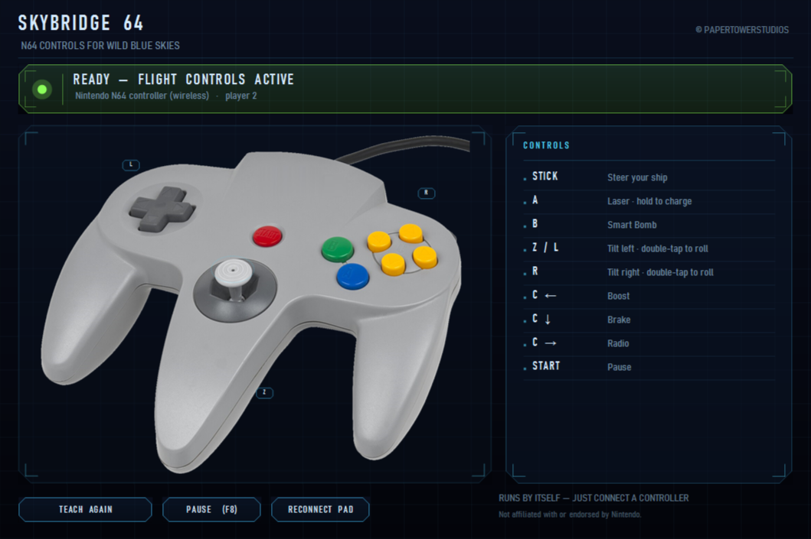

# Skybridge 64

**Play *Wild Blue Skies* with a real Nintendo 64 controller.**

*Wild Blue Skies* expects an Xbox-style gamepad. Skybridge 64 reads your N64 controller and
presents it to Windows as a virtual Xbox 360 pad, mapped so that it plays the way *Star Fox 64*
(*Lylat Wars* in PAL regions) did on the original hardware. No installer, no configuration —
unpack and run.

*Not affiliated with, authorised by or endorsed by Nintendo, Chuhai Labs, VITEI BACKROOM or
Balor Games.*



Nothing to set up. Start it, plug the pad in, and it says so.

---

## The point: one button for both shots

This is the part that makes it feel right, and it is the reason the tool exists.

In *Star Fox 64* there is **no separate button for the tracking / lock-on shot**. The same button
does both, and *how long you hold it* decides which one you get. Skybridge 64 reproduces that:

| You do | You get |
|---|---|
| **Tap A** | a normal laser shot |
| **Hold A** | the laser charges — this is the tracking / lock-on shot |
| **Release A** | the charged shot fires |

There is no second button to learn and nothing to configure. Holding past **370 ms** switches
from firing to charging; letting go is what releases the shot.

Tapping repeatedly is not throttled by the bridge: a press fires immediately, and holding adds
two follow-up shots (at +3 and +7 frames of a 30 fps frame, i.e. ~100 ms and ~230 ms) before the
laser goes quiet and starts charging — the same burst pattern as the original, up to about
15 shots per second.

The same button also confirms menus and skips cutscenes, so you never need to reach for the
Xbox pad.

## Controls

| N64 | Action |
|---|---|
| Stick | Steer your ship |
| A | Laser · hold to charge (tracking shot) |
| B | Smart Bomb |
| Z / L | Tilt left · double-tap to roll |
| R | Tilt right · double-tap to roll |
| C left | Boost |
| C down | Brake |
| C right | Radio |
| START | Pause |

C up is deliberately unassigned — the game has nothing for it.

## Getting started

1. Download the ZIP from [Releases](../../releases), unpack it anywhere — **keep the files
   together in one folder**.
2. Run `Skybridge64.exe`.
3. If it asks, press **Set up now** once — that installs the ViGEmBus driver, which is what
   creates the virtual gamepad. The installer is the file sitting next to the EXE; nothing is
   downloaded, and you are welcome to run or inspect it yourself first — it is signed by
   Nefarius.
4. Connect your N64 controller — a USB adapter or a wireless pad.
5. Start the game.

That order matters: the game picks up its controllers at startup. Other controllers may stay
plugged in; the status line shows which player number Windows assigned, and the game accepts it
either way.

Windows will warn about an unknown publisher, because this program is not code signed. Choose
**More info → Run anyway**. If that bothers you, build it yourself — see below, it takes seconds.

## Supported controllers

Around 40 adapter models are recognised by their USB vendor/product ID, including DragonRise,
Mayflash, Hyperkin, Retro-Bit, 8BitDo, raphnet and Nintendo's own wireless N64 pad over
Bluetooth. Two of them have been measured on real hardware; the rest come from public device
databases.

An unrecognised adapter is not a dead end: the program asks you to press each button once and
remembers it from then on, stored in `%LOCALAPPDATA%\Skybridge64\`.

> **Nintendo's wireless N64 pad must be connected over Bluetooth.** Over the USB cable it
> reports 18 buttons and sends nonsense — the cable is for charging only. Skybridge 64 detects
> this and says so instead of firing on its own.
>
> That pad also reconnects on its own initiative, and Windows cannot force it. If it stops
> coming back after being disconnected for a while, press **A** first — that wakes it when it is
> only asleep. If nothing happens, remove it under *Settings → Bluetooth*, hold **SYNC** until
> the lights blink fast, and pair it again. Windows may still show it as connected while it is
> not; that display is not reliable for this pad.

## Building it yourself

No toolchain to install. `csc.exe` ships with .NET Framework 4, which is already on every
Windows 10/11 machine.

```powershell
.\build.ps1
```

That produces `Skybridge64.exe` and `dist/Skybridge64-1.0.zip`. Everything the build needs is in
this repository.

### How it works

- The N64 pad is read through the legacy joystick API (`winmm.dll`, `joyGetPosEx`) at ~250 Hz,
  because these adapters are DirectInput-only and games like this one want XInput.
- Output goes through [ViGEmBus](https://github.com/nefarius/ViGEmBus), a signed kernel driver
  that presents a genuine virtual Xbox 360 controller to Windows.
- **The ViGEm library and the ViGEmBus installer are shipped as plain files next to the EXE, on
  purpose.** An earlier build embedded both and unpacked the installer at runtime to launch it
  elevated. That is textbook dropper behaviour, and Windows Defender duly flagged it
  (`Trojan:Win32/Sabsik.EN.B!ml`) and deleted the file on extraction. Visible files are not only
  quieter — they are more honest: you can check the installer's Nefarius signature yourself
  before anything runs. Only the controller photo is still a compiled-in resource.

Source layout:

```
src/       Skybridge64.cs      devices, mapping, layouts, virtual pad
           Skybridge64UI.cs    HUD drawing helpers
           Skybridge64Main.cs  main window, polling loop, fire logic
assets/    controller photo and application icon - build inputs
vendor/    third-party binaries, both by Nefarius: the ViGEm client library
           and the ViGEmBus installer. Both ship in the ZIP.
package/   files that go into the ZIP unchanged: the end-user readme and the
           two third-party licence texts
tools/     helper programs that produced the icon and the photo. Not part of
           the build - included so both are reproducible.
```

## Support

If this saved your evening, you can [buy me a coffee on Ko-fi](https://ko-fi.com/papertowerstudios).
Entirely optional — the tool is free and always will be.

## Third-party components

| Component | Licence | Notes |
|---|---|---|
| [ViGEmBus](https://github.com/nefarius/ViGEmBus) by Nefarius Software Solutions e.U. | BSD 3-Clause — [`package/ViGEmBus-LICENSE.txt`](package/ViGEmBus-LICENSE.txt) | kernel driver, installer in `vendor/`, shipped in the ZIP |
| [ViGEm.NET](https://github.com/nefarius/ViGEm.NET) by Nefarius Software Solutions e.U. | MIT — [`package/ViGEm.NET-LICENSE.txt`](package/ViGEm.NET-LICENSE.txt) | the `Nefarius.ViGEm.Client.dll` in `vendor/` |

Both are independent projects. Their authors have no involvement in Skybridge 64 and do not
endorse it.

The controller photograph in `assets/` is a public-domain image; the embossed manufacturer
wordmark was removed from it with `tools/logoweg.cs`, which is included so the change is
reproducible and visible.

## Licence

MIT — see [`LICENSE`](LICENSE). Do what you like with it.

## Legal

Skybridge 64 is an unofficial, fan-made accessory tool. It contains no game code and no game
assets, and reuses nothing from any Nintendo title. "Nintendo 64", "Star Fox 64", "Lylat Wars"
and "Wild Blue Skies" are named only to describe which hardware this tool works with, which game
it targets, and which control scheme it reproduces. All trademarks belong to their respective
owners.
